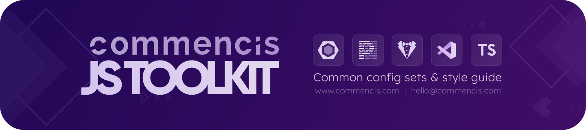

<picture>
  <source media="(max-width: 400px)" srcset="./assets/js-toolkit-logo-mobile.png">
  
</picture>

<h1 align="center">
  Commencis JS Toolkit

[](LICENSE)

</h1>

This project is a comprehensive suite of internal packages designed to elevate JavaScript coding standards at [Commencis](https://www.commencis.com/).

The repository is structured as a monorepo, which allows for managing all the packages together in a unified manner. Please follow the information given in each package's own `README` file for integrations and configurations.

## Package Index

| Package                                                        | NPM                                                                                                                                                |
| -------------------------------------------------------------- | -------------------------------------------------------------------------------------------------------------------------------------------------- |
| [`@commencis/commitlint-config`](./packages/commitlint-config) | [](https://npmjs.com/package/@commencis/commitlint-config) |
| [`@commencis/eslint-config`](./packages/eslint-config)         | [](https://npmjs.com/package/@commencis/eslint-config)         |
| [`@commencis/eslint-plugin`](./packages/eslint-plugin)         | [](https://npmjs.com/package/@commencis/eslint-plugin)         |
| [`@commencis/stylelint-config`](./packages/stylelint-config)   | [](https://npmjs.com/package/@commencis/stylelint-config)   |
| [`@commencis/prettier-config`](./packages/prettier-config)     | [](https://npmjs.com/package/@commencis/prettier-config)     |
| [`@commencis/ts-config`](./packages/ts-config)                 | [](https://npmjs.com/package/@commencis/ts-config)                 |

## For Contributors:

### Prerequisites

#### Node.js

Before you begin, ensure you have `node: >= 20.18` installed on your system.

#### pnpm

This project uses `pnpm: >= 9.12.3` as the package manager. You can install it either by activating with `corepack` which is the recommended way:

```bash
corepack prepare pnpm@latest --activate
corepack enable pnpm
```

or install globally on your system with npm.

```bash
npm install -g pnpm
```

### Installation

Run the following command to install project dependencies:

```bash
pnpm install
```

### Development

You can run the following command to start development environment:

```bash
pnpm run dev
```

## Contribution

We welcome contributions to improve this project. Feel free to open issues or pull requests to suggest enhancements or report any issues.

> [!IMPORTANT]
> For developers contributing to this project, it's important to familiarize yourself with these tools, as they are integral to the workflow and code quality standards.

## License

This project is licensed under the [Apache License 2.0](https://opensource.org/licenses/Apache-2.0) - see the [LICENSE](./LICENSE) file for details.

© [Commencis](https://www.commencis.com/), 2024. All rights reserved.
